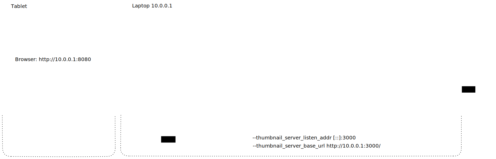

# Live H264 Glitcher

Creates glitch effects in H.264 encoded videos by removing keyframes, combining videos, looping intermediate frames.

Can be controlled via OSC.


https://user-images.githubusercontent.com/4194320/148616193-57d7ca6b-afb8-4751-b33e-0c5017b6872c.mp4

## Using the Glitcher
### Prepare Videos

Videos have to be in a folder with the following structure:
```
videos/
    original/  # Used by the doit script
        video1.mp4
    encoded/
        video1.h264
    thumbnails/
        video1.png
```

You can copy the the [doit](https://pydoit.org/) script in `scripts/dodo.py` to your videos folder and use it to encode all videos in the `original` folder. Doit stores hashes of files it already processed so it will only encode new or changed videos again.

```
pip install doit
cp scripts/dodo.py videos/
cd videos
doit
```

### Run glitcher
```
cargo run --release -- --input-dir videos/ |  mpv --no-correct-pts --fps=1000 --no-cache -
```
We had reports of crashing AMD GPUs when using hardware decoding. If you are experiencing problems add `--hwdec=no` to your `mpv` command.  

Use the `--prefetch` option to load all videos into RAM. Takes longer to start, but makes video switching much smoother.

By default the glitcher listens on port 8000 for OSC messages.

### Control using OpenStageControl

Install [OpenStageControl](https://openstagecontrol.ammd.net/).

You can load our pre-made [OpenStageControl session](open_stage_control/h264_glitcher_Session.json).

Example network config for a tablet controlling the glitcher running on a laptop:



## Technical info
### OSC messages

Instead of using our pre-made [OpenStageControl session](open_stage_control/h264_glitcher_Session.json) you can also send OSC commands yourself.

We are constantly experimenting with different commands and features ;).
Please refer to the `State::default` struct initialization in `src/bin/h264_glitcher.rs` as well as the `osc_listener` function for the list of currently implemeted OSC commands.

### Video Encoding

Use ffmpeg to convert the videos to a raw h264 stream
```
ffmpeg -i video.mp4 video.h264
```

It can also be helpful encode all input videos the same way, otherwise transitions between videos don't work properly.
These settings have an effect on the glitch effects look in general and could probably be optimized still.
They also have an effect on how likely mpv is to lock up when switching videos.
```
ffmpeg -i video.mp4 -c:v libx264 -vf format=yuv420p,scale=1920:1080 -qp 30 -x264-params bframes=0:refs=1:g=9999999 video.h264
```

[libx264 options](https://code.videolan.org/videolan/x264/-/blob/19856cc41ad11e434549fb3cc6a019e645ce1efe/common/base.c#L952)
Potentially interesting parameters:
- `bframes=0` Disable B-frames
- `refs=1` allow max 1 reference frames for p-frames
- `g=9999999` No keyframes inbetween

Maybe also useful: https://encodingwissen.de/codecs/x264/referenz/

potentially interesting x264 options: `partitions, tune=zerolatency`
